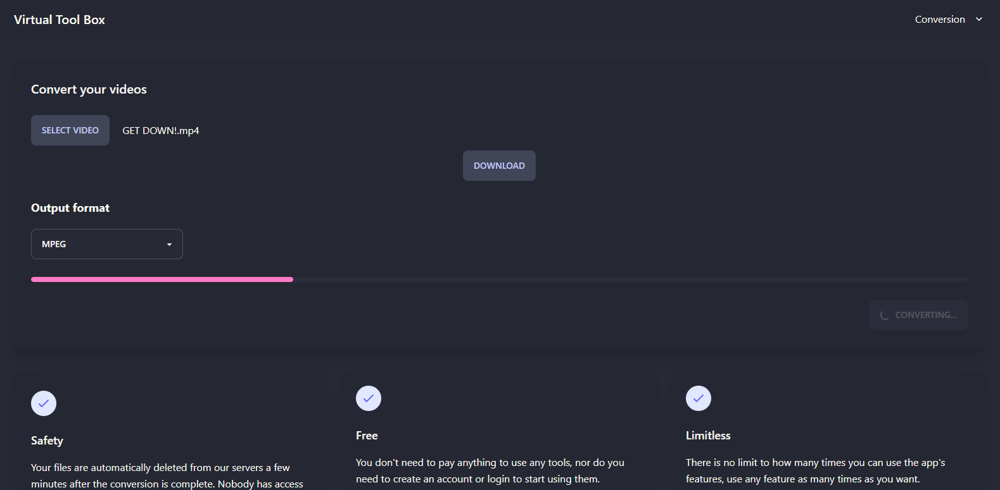

<h1 align="center">Tool Box Virtual - Backend</h1>

<p>Application that converts video to some formats using ffmpeg</p>

<h1 align="center">
  
</h1>

### 🛠 Main technologies

The following tools were used in building the project:

- [Node.js](https://nodejs.org/en/)
- [NestJs](https://nestjs.com/)
- [Redis](https://redis.io/)
- [Socket.IO](https://socket.io/)
- [Aws](https://aws.amazon.com/pt/)
- [Bull](https://github.com/OptimalBits/bull)
- [Ffmpeg](https://ffmpeg.org/)
- [Jest](https://jestjs.io/pt-BR/)
- [TypeScript](https://www.typescriptlang.org/)

### 💻 Functionalities

- ✅ Video conversion

### ⚠️ Prerequisites

- [Install Nodejs](https://nodejs.org/en/)
- [Install Redis](https://redis.io/)
- [Install ffmpeg](https://ffmpeg.org/)

## Installation

```bash
$ npm install
```

## Running the app

```bash
# development
$ npm run start

# watch mode
$ npm run start:dev

# production mode
$ npm run start:prod
```

## Test

```bash
# unit tests
$ npm run test

# e2e tests
$ npm run test:e2e

# test coverage
$ npm run test:cov
```

### 📄 License

- [MIT](https://nodejs.org/en/)
